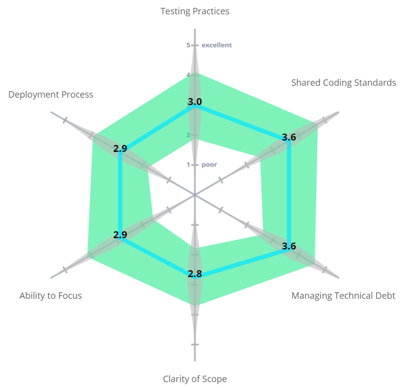
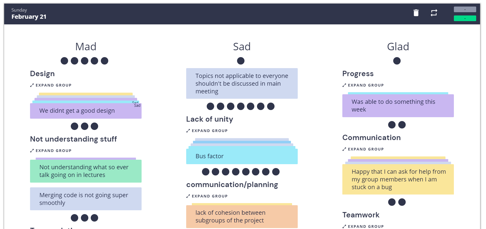

# Team 25 Retrospective Meeting

**Location:** Zoom, Retrium

**Date:** 02/21/21, 7:35 PM

## Attendance

**Present:** Eric, Yuchen, Ainesh, Andrew, Jaslina, Justin, Neel, Sujan, Tom

**Absent:** None

## Current Objective
Hold sprint 1 retrospective in adherence to Agile ceremonies

## Notes

* Testing -- we will work on consistency of testing each feature -- this week was hard-pressed on time for both groups
* Scope -- more clearly defined issues for facilitating work
* Subgroups are all somewhat disconnected -- hard to integrate between different groups -- discuss progress more in meetings
* Allow for more freedom in what each person is working on -- lower bus factor
* Design/final plan is a bit foggy -- would like to better clarify our overall progress and define goals
* Lack of unity -- not a lot of shared time even between subgroups
	* Though it did happen sometimes, and pair programming was effective when it happened
	* Promote more use of groupwork in sprints -- VSCode liveshare
	* Yuchen has experience with JS -- can be consulted
* Design -- blocked by code production, but sketches need lots of work
	* Design mocks are a group effort
	* Mention any blocks in Slack, as part of your stand-downs in #updates
* Workflow -- not everyone understands how they work -- ask if in doubt
* Underestimating time available/time spent -- mention blocks in understanding/implementation earlier
* Technical understandings -- refer to system diagrams for our code structure
* No time to get huge :(
* Pair people with similar schedules together
* Prioritize PR reviews over producing code
* Next meeting (or in separate meeting) -- discuss merging of subgroups
* Overall, communication has been good -- no ghosting
* Good teamwork between members
* Make sure we stick to meeting agendas -- don't get caught up on certain things

## Screenshots

**End time:** 8:25 PM
