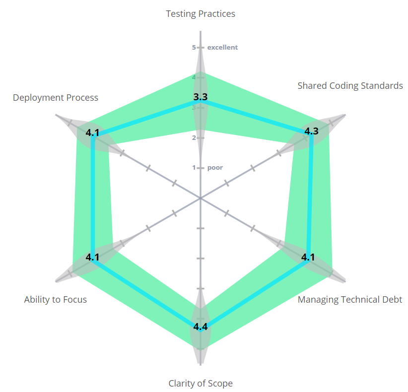
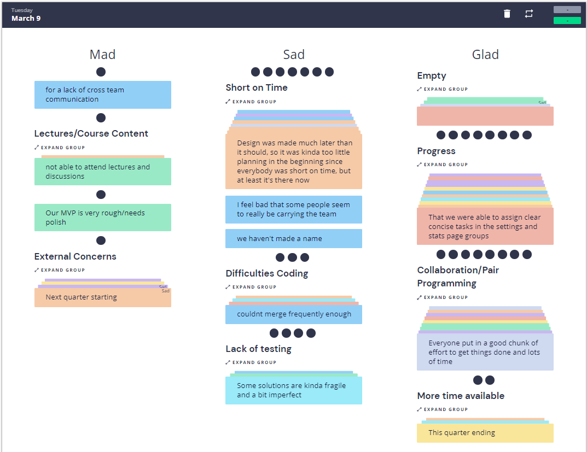

# Team 25 Sprint 2 Retrospective Meeting

**Location:** Zoom, Retrium

**Date:** 03/09/21, 3:30 PM

## Attendance

**Present:** Eric, Yuchen, Ainesh, Andrew, Jaslina, Justin, Neel, Sujan, Tom

**Absent:** None

## Current Objective

Hold sprint 2 retrospective in adherence to Agile ceremonies

## Notes

* Progress -- very significant work was done compared to sprint 1
* Collaboration -- more of it happened, helped us be more productive
* Short on time -- still need significant work to finish on time
* Lack of testing -- needed to sacrifice testing in favor of faster merges

## Screenshots

**End time:** 4:00 PM
